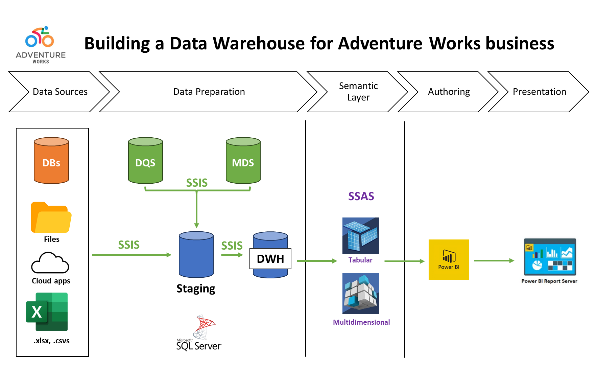

# Data Warehouse Implementation in SQL-SSIS
- Tools: SQL + SSIS + SSAS + PowerBI
- Author: Bruno M. Guerreiro
- Date: 26/Jan/2024

This is an end-to-end project on DWH implementation using the [Adventure Works sample dataset](https://github.com/Microsoft/sql-server-samples/releases/tag/adventureworks) from Microsoft. Adventure Works is a multinational manufacturing company of mountain bikes, spanning over 10 territories, with over 500 products and a 15k+ customer base. I was tasked with building a Data Warehouse from OLTP data. The tables were separated by Sales, HR and Personnel tables but they lacked a proper segmentation of sales made online or on-site.

### Tools
- Microsoft SQL Server
- SSIS
- SSAS
- PowerBI

### Design Rationale

### Steps
1. Create staging Layer
2. Dimensional Modelling (Design Star Schema)
3. Identify Facts (online/offline sales)
4. Identify Dimensions and Types
5. Create DW database
6. Create DB Objects
7. ETL Truncate-Load source to staging
8. ETL Load Staging to DW with incremental loading and refreshes (control procedures)
9. Control Packages with SQL Server Agents, Job Scheduling
10. Create SSAS Tabular Model
11. Obtain Total Orders quantity using DAX (semantic layer)
12. Report in PowerBI
