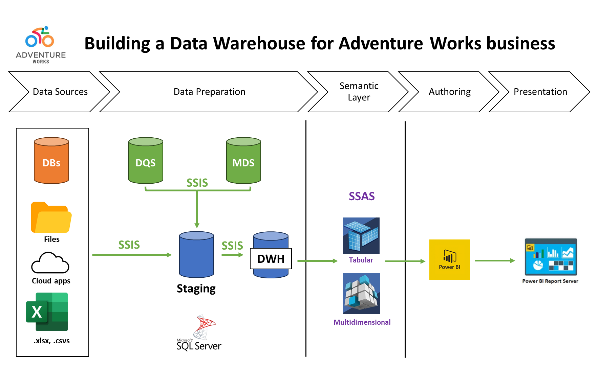

# Adventure Works: Data Warehouse Implementation
Tools: SQL + SSIS + SSAS + PowerBI
Author: Bruno M. Guerreiro
Date: 26/Jan/2024

## Introduction
This is an end-to-end project on DWH implementation using the [Adventure Works sample dataset](https://github.com/Microsoft/sql-server-samples/releases/tag/adventureworks) from Microsoft.

## Goal (case study)

## Data
https://github.com/Microsoft/sql-server-samples/releases/tag/adventureworks
https://drive.google.com/file/d/1-oEOH-CHCmuyVKCWCPXceLsqUXmO0_Xo/view

## Table of Contents
tbf later

## Design Rationale

## DW Architecture
Data warehouses are needed to integrate different sources of data, useful to perform analysis on OLAP databases and store historical data outside the OLTP ecossystem.

...

## Business Case Study
Adventure Works is a multinational manufacturing company of mountain bikes, spanning over 10 territories, with over 500 products and a 15k+ customer base. I was tasked with building a Data Warehouse from OLTP purchase/production, HR and sales data. They're also interested in having a quick analytical overview of the business, to understand financial health of the business.

## Rationale
1. Identify subject area
2. Identify facts
3. Identify dimensions/types
4. Set schema granularity

## DWH Design
### 1. Staging Layer
### 2. Dimensional Modelling (Design Star Schema)
#### 2.1. Identify Fact
#### 2.2. Identify Dimension and Type

### DWH Implementation
#### 1. Create DW Database
#### 2. Create DB Objects

### SSIS
#### 1. ETL Load Source to Staging
#### 2. ETL Load Staging to DW
#### 3. Control Packages

### SSAS
#### 1. Create Tabular Model
#### 2. Calculations using DAX

### Scheduling Jobs
#### 1. Datawarehouse
#### 2. PowerBI

